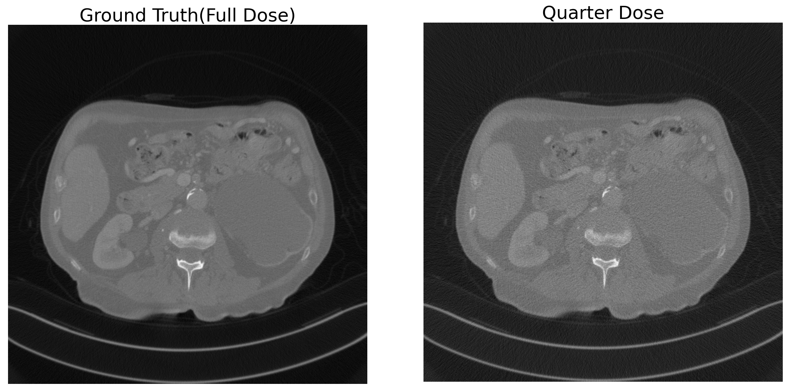
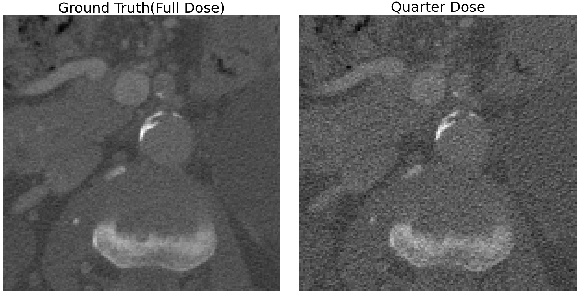

# Low Dose CT Denoising using Cycle GAN
### Using Low Dose CT data from [AAPM](https://www.aapm.org/)

You can find details about Low Dose CT Grand Challenge from this [Official Website.](https://www.aapm.org/grandchallenge/lowdosect/#trainingData)

You can download data set(~8.3GB) from [data link](https://drive.google.com/drive/folders/1pC7Coiu3bcPAy2Kno7b6jdyLzcs-G1Gz?usp=sharing).

Download the data and place ```data``` folder in main project directory.

- - -

## Objective
- The goal of this challenge and our project is to denoise low dose(quarter dose) CT Image to get high dose(full dose) CT Image.

## Data Preview
Inside the ```data``` folder you will find two sub folder ```qd``` and ```fd``` each representing quarter dose and full dose.

Quarter dose corresponds to low dose and full dose corresponds to high dose.

Typical data look like below.



You can see the noise in quarter dose image compared to full dose image. 

For clarity, I also included center cropped image below.



## Model Structure

We mainly followed [Original paper](https://arxiv.org/abs/1703.10593?amp=1) and [Official Implementation.](https://github.com/junyanz/pytorch-CycleGAN-and-pix2pix)

### Generator

For the generator, we used ***U-net*** based generator. 

U-net based generator's structure is not presented in Cycle GAN paper, but you can find code in the official implementation. -> [Link](https://github.com/junyanz/pytorch-CycleGAN-and-pix2pix/blob/9bcef69d5b39385d18afad3d5a839a02ae0b43e7/models/networks.py#L436)

Following exact same structure given in official code, we made U-net generator structure image, presented below.


From the above structure, we made slight change for our task.

1. In the Cycle GAN author's U-net generator they did't used concatenation at the outter most layer, but we found that for denoising task, concatenating input layer to output layer improves denoising ability. 
